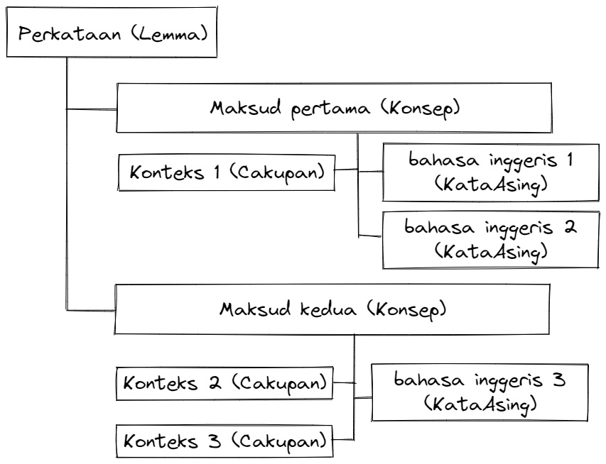

# Samudra


Sebuah aplikasi untuk memudahkan pencatatan istilah serta pengongsiannya sesama rakan sekerja atau orang awam.
Dengan memudahkan proses ini, kita dapat menambah jumlah rujukan bahasa Melayu dalam talian sekali gus mempercepatkan
perkembangannya dari segi penggunaan, penyelidikan serta pembelajarannya.

## Model

Model kamus direka supaya selari dengan padanan satu kata boleh mendukung banyak konsep
serta satu perkataan boleh dipadankan ke banyak kata asing yang bergantung pada konsep dan konteks yang digunakan.



## Tentang Aplikasi

### Prasyarat

1. [Python 3.8](https://www.python.org/) atau lebih tinggi
2. [Poetry](https://python-poetry.org/docs/) untuk pengurusan keperluan projek
3. [Git](https://git-scm.com/) untuk kawalan perubahan kod

### Pemasangan

1. Salin repositori ini guna git ke dalam folder bernama 'samudra'
    ```shell
   $ git clone https://github.com/Thaza-Kun/samudra.git samudra
   ```
2. Masuk ke dalam folder samudra
    ```shell
   $ cd samudra
   ```
3. Dapatkan semua keperluan projek menggunakan poetry
    ```shell
   $ poetry install
   ```

### Mulakan pelayan

Setelah selesai langkah pemasangan, mulakan pelayan menggunakan poetry
(poetry digunakan bagi memastikan arahan dalam fail python dilaksanakan
menggunakan keperluan yang sudah dijelaskan dalam fail `pyproject.toml`)

```shell
$ poetry run python ./samudra/serve.py
```

### Menyumbang kod

1. Buat cabang baharu agar setiap perubahan tersebut tidak mengganggu cabang utama. Namakan cabang secara deskriptif (
   seperti menamakan ciri yang ingin ditambah).
    ```shell
   $ git checkout -b nama_cabang
   ```
2. Buat perubahan yang diinginkan. Pastikan `git commit -m "ringkaskan perubahan di sini"` untuk simpan perubahan.
3. Hantar cabang perubahan ke repo github. Gunakan `nama_cabang` yang sama dengan langkah pertama.
    ```shell
   $ git push --set-upstream origin nama_cabang
   ```
4. Hantar _pull request_ dan jelaskan perubahan yang telah dilakukan.

## Penciptaan lemma / konsep

Bagi memudahkan penulisan konsep, samudra menggunakan pencatatan berconteng tapis contengan tersebut menjadi struktur
yang bermakna. Contengan perlu diletakkan di hujung keterangan kalau tidak, akan dihantar `SyntaxError` kerana ada lebih
dari satu kandungan teks.

- Contengan tagar `#` menandakan cakupan konsep tersebut. Misalnya, `#sains` menunjukkan konsep tersebut digunakan dalam
  sains. Boleh ada banyak tagar untuk setiap konsep.
- Contengan kurungan bertitik tindih `{kunci:nilai}` memadankan nilai pada kuncinya. Tanda titik `.` digunakan bagi
  meletakkan kata kunci dalam kata kunci. Buat masa ini, hanya kunci-kunci berikut yang diterima:
    - `{lang.en:nilai}` akan memadankan konsep ke kata asing berbahasa inggeris. Boleh padankan banyak kata asing ke
      satu konsep. Kata asing berbahasa lain masih sedang diusahakan.
    - `{terj.en:nilai}` (kependekan untuk 'terjemah') akan buat benda sama dengan `{lang.en:nilai}` (boleh bercampur).
    - `{meta.gol:NAMA}` akan meletakkan penggolongan kata pada konsep tersebut. Ini adalah nilai wajib dan hanya satu
      golongan untuk setiap konsep.

Ini adalah contoh menggunakan [httpie](www.httpie.io).

```shell
http POST :8000/lemma/nama body="keterangan konsep #pasar #percakapan {terj.en:name} {lang.en:new} {meta.gol:NAMA}"
```

akan menghasilkan

```json
{
  "lemma": "nama",
  "konsep": {
    "keterangan": "keterangan konsep",
    "golongan": "NAMA",
    "cakupan": [
      "pasar",
      "percakapan"
    ],
    "kata_asing": [
      {
        "bahasa": "en",
        "nama": "name"
      },
      {
        "bahasa": "en",
        "nama": "new"
      }
    ]
  }
}
```

## Ingin Menyumbang?

- Bahagian frontent boleh ke repo [alserembani94/laman-samudra](https://github.com/alserembani94/laman-samudra/).
  Terima kasih @alserembani94 kerana sudi menggerakkan bahagian laman!
- Boleh tambahbaik aplikasi dari segi _pull request_ (ikut arahan di bahagian [# Menyumbang Kod](#menyumbang-kod)) atau
  sekadar cadangan
- Boleh sumbangkan secangkir kopi di [Ko-fi](https://ko-fi.com/thaza_kun)

Boleh hubungi saya melalui emel [makmal.thaza+samudra@gmail.com](mailto:makmal.thaza+samudra@gmail.com) atau di
Twitter [@Thaza_Kun](www.twitter.com/Thaza_Kun).
