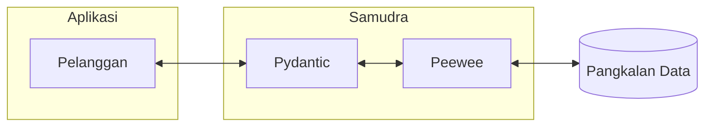

# Teknologi Teras

Berikut merupakan teknologi teras yang menggerakkan Samudra dari dalam:

1. [Python ^3.8](https://www.python.org/)
    - Teras Samudra ditulis dalam bahasa Python.
2. [Peewee ^3.15.1](http://docs.peewee-orm.com/en/latest/index.html)
    - Peewee membantu Samudra berinteraksi dengan pangkalan data. 
        Setiap data yang dipetik dari pangkalan data dibentuk sebagai satu [`model`](model.md).
3. [Pydantic ^1.9.1](https://pydantic-docs.helpmanual.io/)
    - Pydantic membantu Samudra membentuk data dalam cara yang difahami oleh aplikasi yang berada di luar teras.

Secara asasnya, beginilah carta alir data dalam sebuah aplikasi Samudra:

