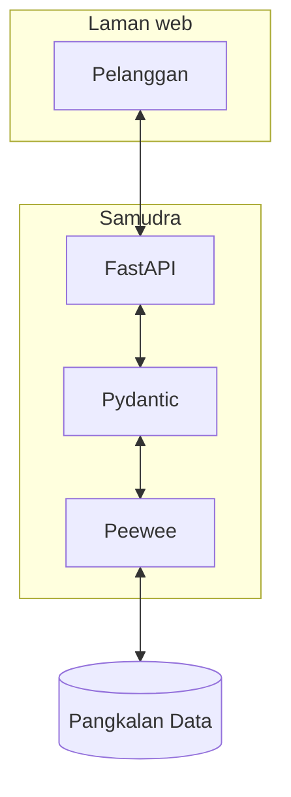

# Teknologi Teras

Berikut merupakan teknologi teras yang menggerakkan Samudra dari dalam:

1. [Python ^3.8](https://www.python.org/)
    - Samudra bahagian pelayan ditulis dalam bahasa Python.
2. [Peewee ^3.15.1](http://docs.peewee-orm.com/en/latest/index.html)
    - Peewee merupakan pengurus pangkalan data dalam bentuk objek Python (iaitu sejenis ORM) yang ringan dan mudah
      digunakan. Setiap data dibentuk sebagai satu [`model`](model.md).
3. [FastAPI ^0.79.0](https://fastapi.tiangolo.com/)
    - Fast API merupakan pengurus API yang membantu menghantar data yang diminta pihak pelanggan.
4. [Pydantic ^1.9.1](https://pydantic-docs.helpmanual.io/)
    - Pydantic merupakan pengurus bentuk data yang memastikan data yang berpindah dari fungsi ke fungsi atau dari
      pangkalan data ke API mematuhi bentuk yang ditakrifkan. Hal ini memastikan datanya kekal berintegriti.

Secara asasnya, beginilah carta alir data dalam sebuah aplikasi Samudra:

